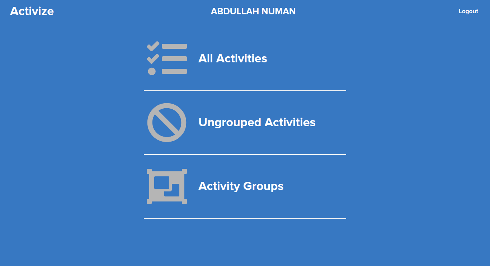
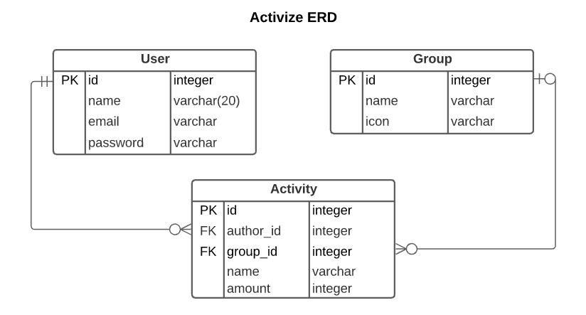

# Activize

## App Screenshot

## Built With

* Ruby v 2.7.1
* Rails v 6.0.3.3
* Devise
* Bulma
* Simple Form
* PostgreSQL
* RSpec
* Capybara
* FactoryBot
* Faker Gem

## Database ERD

## Deployment

## Author
👤 **Abdullah Numan**

- Github:   https://github.com/anewman15
- Twitter:  https://twitter.com/aanuman15
- Linkedin: https://www.linkedin.com/in/aanuman15/
- Email:    anewman15@hotmail.com

## 🤝 Contributing

Contributions, issues and feature requests are welcome!

Feel free to check the [issues page](https://github.com/anewman15/activize/issues/).

## Show your support

Give a ⭐️ if you like this project!

## Acknowledgments

- https://www.microverse.org/
- https://www.theodinproject.com/
- https://guides.rubyonrails.org/
- https://www.stackoverflow.com/
